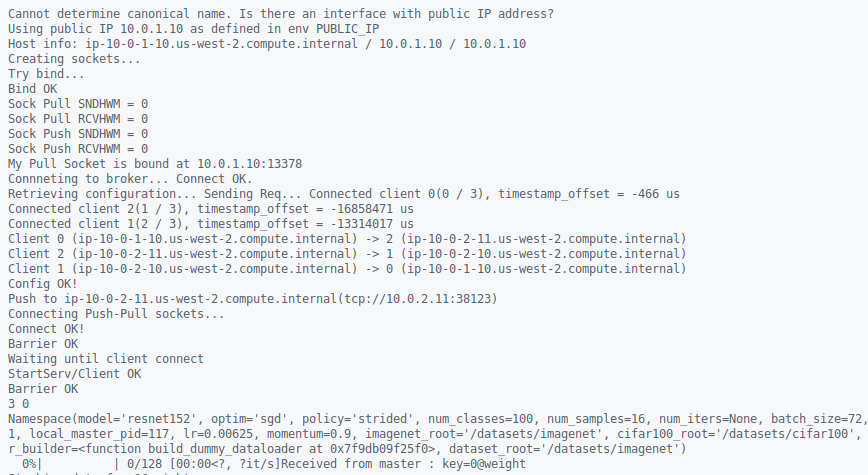

# StellaTrain Terraform Deployment Infra

The following repo uses Terraform to reproduce and scale the deployment of **StellaTrain : Accelerating Model Training in Multi-cluster Environments with Consumer-grade GPUs** (See Lim et al. 2024 [[Paper]](https://dl.acm.org/doi/10.1145/3651890.3672228), [[GitHub]](https://github.com/kaist-ina/stellatrain)). 


## Overview

This repo is created to simplify the overhead needed managing AWS EC2 instances, making it accessible to other interested researcher.

By utilizing TF Infra as Code, reusability, creation, modification, and overall managing an experiment infrastructure will be easier.


## Quick Start

First, create and fill `terraform.tfvars` with your credentials.

Example:
```
region         = "us-west-2"
zones          = ["us-west-2a", "us-west-2b", "us-west-2c"]
csp            = "aws"
csp_domain     = "amazonaws.com"

access_key_id = <insert-your-access-key-here>
secret_access_key = <insert-your-secret-access-key-here>

```

Then run
```bash
terraform init  # Install module
terraform plan  # See the planned resources
terraform apply # Create the resources
```

The cluster should be created automatically and by default will train on dummy dataset. To connect to the instance, Stella-Master is the main SSH point.
After accessing the master server, you could access other instance directly by their private IP address.

Onced finished testing, you clean-up everything by running
```bash
terraform destroy
```

## Monitoring Training Progress
When EC2 instances were created, it will first run the `scripts/init.sh`.

We can SSH to the designated node with the generated pem key
```bash
ssh ubuntu@instance-public-ip-here -i stella-key.pem
```

To follow the initialization progress, you can run
```bash
tail -f /var/log/cloud-init-output.log
```

Once the init script finish, you can attach the created container and run the train command
```
ubuntu@ip-10-0-1-10:~$ sudo docker ps
CONTAINER ID   IMAGE                                COMMAND                  CREATED         STATUS         PORTS     NAMES
63b4d5d65dd4   ghcr.io/kaist-ina/stellatrain:main   "/opt/nvidia/nvidia_…"   3 minutes ago   Up 3 minutes             suspicious_mcnulty

ubuntu@ip-10-0-1-10:~$ sudo docker attach suspicious_mcnulty
stellatrain@ip-10-0-1-10:~/explore-dp$
```

Example result:



## Architecture
The code as is, will deploy the following resources:


While StellaTrain can be used with public IP, the convinience of creating our own subnet and IP creations greatly simplify this deployment. Future work will be to fetch the assigned public IP and use them instead of private IP; to test multiple worker.